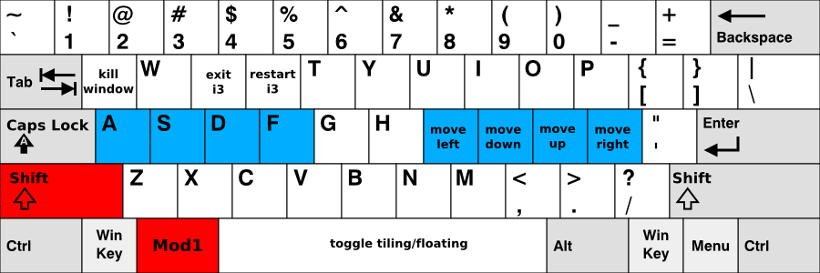

# i3 dot-files

* Αποθήκευση του [config](./config) στον φάκελο **.config/i3/**  
* Αποθήκευση του αρχείου [.i3status.conf](./.i3status.conf) στον φάκελο του **χρήστη (~)**  

## Συνδυασμοί πλήκτρων

## Cheatsheet

Κατεβάστε το αρχείο από [εδώ](./i3%20-%20Reference%20Card.pdf)
